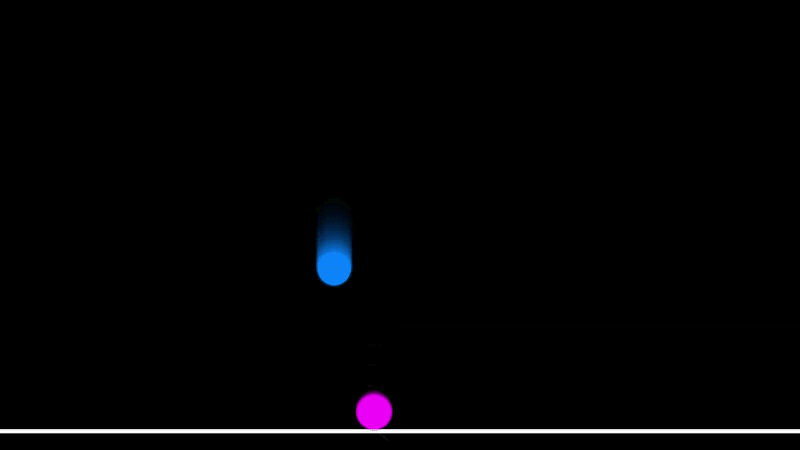

# Ball Physics Simulator

A 2D physics sandbox built with pygame featuring collision physics, particle effects and glow rendering.

 

---

## What it does

Spawn balls and watch them bounce around with realistic physics. Balls collide with each other and the walls, throw off particles on impact, and can be dragged and flung around. Supports multiple balls at once.

## Requirements

```
pip install pygame
```

On Windows you'll also need to install [Npcap](https://npcap.com) for audio to work properly.

## How to run

```bash
python main.py
```

Make sure `mushroom.jpg`, `pop.wav` and `thud.wav` are in the same folder.

## Controls

| Input | Action |
|---|---|
| Left click (empty space) | Spawn a new ball |
| Left click + drag (on a ball) | Pick up and throw a ball |
| W / Up arrow / Space | Jump |
| A / Left arrow | Move left |
| D / Right arrow | Move right |
| Shift | Slow motion |
| F | Toggle fullscreen |
| Backspace | Delete last ball |
| R | Reset everything |
| 0 | Quit |

## Features

- Impulse-based ball collision with overlap correction
- Particle effects on ball and ground collisions
- Glow rendering on balls and particles
- Drag and throw mechanics with velocity tracking
- Slow motion mode
- Fullscreen support

## Notes

This was a learning project — mainly an excuse to figure out collision physics and particle systems from scratch. The physics aren't perfect but it feels good to play with.

